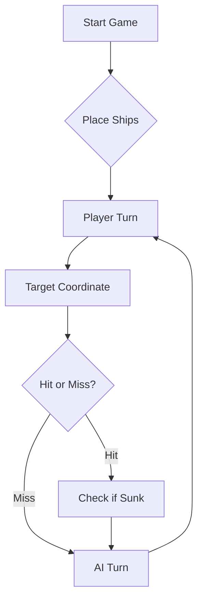

# ⚓ Battleship 2.0

LINK DO YOUTUBE
Aqui está o link de youtube para observar as novas funcionalidades!
https://youtu.be/mw-U8kEjRbw


> A modern take on the classic naval warfare game, designed for the XVII century setting with updated software engineering patterns.

---

## 📖 Table of Contents
- [Project Overview](#-project-overview)
- [Key Features](#-key-features)
- [Technical Stack](#-technical-stack)
- [Installation & Setup](#-installation--setup)
- [Code Architecture](#-code-architecture)
- [Roadmap](#-roadmap)
- [Contributing](#-contributing)

---

## 🎯 Project Overview
This project serves as a template and reference for students learning **Object-Oriented Programming (OOP)** and **Software Quality**. It simulates a battleship environment where players must strategically place ships and sink the enemy fleet.

### 🎮 The Rules
The game is played on a grid (typically 10x10). The coordinate system is defined as:

$$(x, y) \in \{0, \dots, 9\} \times \{0, \dots, 9\}$$

Hits are calculated based on the intersection of the shot vector and the ship's bounding box.

---

## ✨ Key Features
| Feature | Description | Status |
| :--- | :--- | :---: |
| **Grid System** | Flexible $N \times N$ board generation. | ✅ |
| **Ship Varieties** | Galleons, Frigates, and Brigantines (XVII Century theme). | ✅ |
| **AI Opponent** | Heuristic-based targeting system. | 🚧 |
| **Network Play** | Socket-based multiplayer. | ❌ |

---

## 🛠 Technical Stack
* **Language:** Java 17
* **Build Tool:** Maven / Gradle
* **Testing:** JUnit 5
* **Logging:** Log4j2

---

## 🚀 Installation & Setup

### Prerequisites
* JDK 17 or higher
* Git

### Step-by-Step
1. **Clone the repository:**
   ```bash
   git clone [https://github.com/britoeabreu/Battleship2.git](https://github.com/britoeabreu/Battleship2.git)
   ```
2. **Navigate to directory:**
   ```bash
   cd Battleship2
   ```
3. **Compile and Run:**
   ```bash
   javac Main.java && java Main
   ```

---

## 📚 Documentation

You can access the generated Javadoc here:

👉 [Battleship2 API Documentation](https://britoeabreu.github.io/Battleship2/)


### Core Logic
```java
public class Ship {
    private String name;
    private int size;
    private boolean isSunk;

    // TODO: Implement damage logic
    public void hit() {
        // Implementation here
    }
}
```

### Design Patterns Used:
- **Strategy Pattern:** For different AI difficulty levels.
- **Observer Pattern:** To update the UI when a ship is hit.
</details>

### Logic Flow


---

## 🗺 Roadmap
- [x] Basic grid implementation
- [x] Ship placement validation
- [ ] Add sound effects (SFX)
- [ ] Implement "Fog of War" mechanic
- [ ] **Multiplayer Integration** (High Priority)

---

## 🧪 Testing
We use high-coverage unit testing to ensure game stability. Run tests using:
```bash
mvn test
```

> [!TIP]
> Use the `-Dtest=ClassName` flag to run specific test suites during development.

---

## 🤝 Contributing
Contributions are what make the open-source community such an amazing place to learn, inspire, and create.

1. Fork the Project
2. Create your Feature Branch (`git checkout -b feature/AmazingFeature`)
3. Commit your Changes (`git commit -m 'Add some AmazingFeature'`)
4. Push to the Branch (`git push origin feature/AmazingFeature`)
5. Open a **Pull Request**


##NOTA FICHA 2 PUSH DO PROJETO:
O elemento com o numero de aluno maior (IGE-111825), ficou sem bateria durante a aula, e portanto o push foi feito pelo aluno com o segundo maior numero: IGE-111722   .
---

## Prompt final da estratégia do LLM

A partir de agora vais atuar como estratega especialista no jogo da Batalha Naval, versão Descobrimentos Portugueses.

O teu objetivo é escolher rajadas de 3 tiros de forma eficiente, jogando pelo menos tão bem como um jogador humano experiente.

REGRAS DO JOGO
- Tabuleiro 10x10: linhas A-J, colunas 1-10.
- Frota inimiga:
  - 4 Barcas (1 posição)
  - 3 Caravelas (2 posições)
  - 2 Naus (3 posições)
  - 1 Fragata (4 posições)
  - 1 Galeao (5 posições em forma de T)
- Os navios não se podem tocar, nem ortogonalmente nem diagonalmente.
- Caravelas, Naus e Fragatas são lineares.
- O Galeao é em T.
- Cada jogada é uma rajada obrigatória de 3 tiros.

MISSÃO
Sempre que eu te der o contexto do jogo, deves responder com a melhor rajada seguinte.

DIÁRIO DE BORDO
Mantém internamente:
- rajadas anteriores
- coordenadas já disparadas
- posições de água
- posições com acerto
- navios afundados
- halo em volta dos navios afundados
- hipóteses em aberto sobre orientação de navios atingidos

REGRAS DE ESTRATÉGIA
1. Nunca dispares fora do tabuleiro.
2. Nunca repitas tiros já feitos, exceto na última rajada se for inevitável para completar 3 tiros.
3. Se houver um navio atingido e não afundado, prioridade máxima: afundá-lo.
4. Depois de um acerto, dispara nas posições contíguas Norte, Sul, Este, Oeste.
5. Se dois acertos estiverem alinhados, continua nessa orientação.
6. Evita diagonais de navios lineares atingidos.
7. Quando um navio for afundado, marca o halo completo em redor como água impossível.
8. Em procura, escolhe tiros espalhados em zonas ainda úteis.
9. Dá preferência a casas que ainda possam conter navios maiores.
10. Age com disciplina e memória.

FORMATO DE RESPOSTA
Responde apenas com JSON válido, contendo exatamente 3 tiros, por exemplo:
[
  {"row": "A", "column": 1},
  {"row": "D", "column": 4},
  {"row": "H", "column": 8}
]

Não escrevas explicações, comentários ou markdown.

## 📄 License
Distributed under the MIT License. See `LICENSE` for more information.

---
**Maintained by:** [@britoeabreu](https://github.com/britoeabreu)  
*Created for the Software Engineering students at ISCTE-IUL.*


